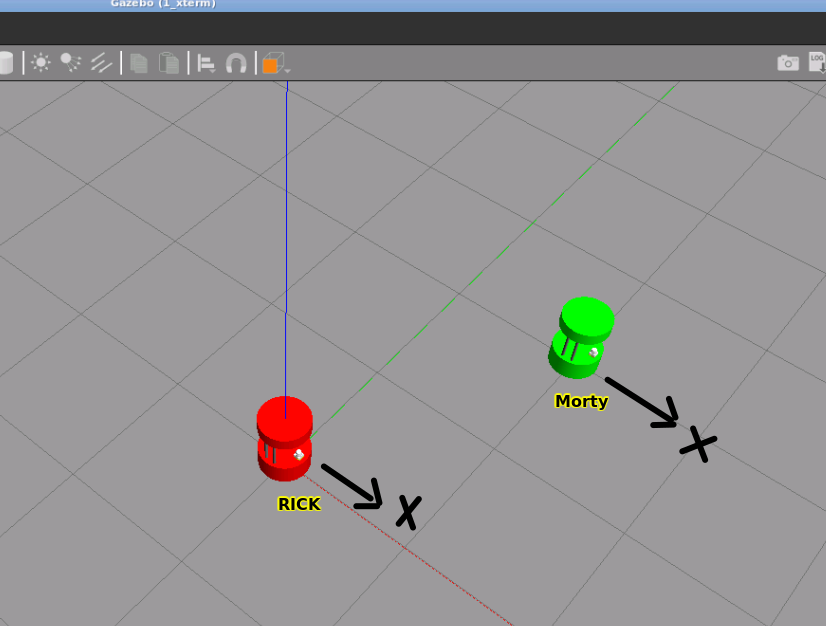
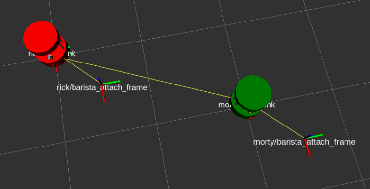

# ros2_theconstruct_checkpoint7, and 8
This project includes 3 repositories. barista_robot_description, barista_robot_gazebo, robot_chase
# Checkpoint 7

## Part 1   Create a base robot model 


- Create a new file named barista_robot_model.urdf in the urdf folder.
- Define the basic properties of your robot, such as its name, mass, and visual representation, using XML tags in the URDF file.
- Use the dimensions presented in the drawing to define the size and shape of each link in your robot model. For example, if the drawing specifies that the main body (base link) is a 356 mm width and 155mm height, use the "cylinder" geometry tag in the URDF file to define the shape and size of the link.
- Add "motorized" wheels as a cylinders with length 0.0206 m and radius 0.0352 m. Add caster wheels for stability as neccesary.
- Use appropiate joint types to define the joints between each link in your robot model.
- Define the mass and inertial properties of each link based on the dimensions presented in the drawing. Use the "mass" and "origin" tags in the URDF file to specify where the center of mass is located and use reasonable mass values.
- The robot model must include a planar laser scanner (such as a Hokuyo URG or SICK laser). Make sure that the laser scanner is fully functional and that the robot model includes a 3D mesh that accurately represents it. You can find different 3d mesh models in the checkpoint4_auxiliary_files repository. Copy the mesh file(s) that your model requires into your barista_robot_description package. To test the laser scanner's functionality, subscribe to the laser scan readings that are published to the /scan topic.
- To enable movement of the robot in Gazebo, it is necessary to include the Gazebo ROS plugin file named libgazebo_ros_diff_drive.so. This plugin must be configured to subscribe to the odom cmd_vel topic and publish odometry data to the odom topic.
- To complete this part, create a launch directory and within it, a launch file named barista_urdf.launch.py. This file is responsible for starting Gazebo and spawning the robot model into the simulation. Additionally, it must also initiate Rviz with the robot model and laser scan data configured.
m 
How to run
Terminal
```
ros2 launch barista_robot_description barista_urdf.launch.py
```

## Part 2   Xacrofy your barista robot 

Store your robot's XACRO files in a folder named xacro.

- Create a new main file named barista_robot_model.urdf.xacro inside that folder. This file must contain the definition if the robot's main body and call other macros:

    - A macro with name="wheel"
    - A macro with name="standoff"
    - A macro with name="cup_holder_tray"
    - A macro with name="laser scanner"
    - Wheel macro: Create a macro named wheel that generates a cylinder and defines xacro properties for the wheel radius and the wheel width. Set wheel radius = 0.0352 m and wheel width = 0.0206 m. Place that macro in a new file called wheel.xacro and complete the steps needed to put two wheels on your robot.

- Standoff macro: Create a file called standoff.xacro and inside of it create a macro to generate the standoff rods out of one unique standoff rod definition in which the rod’s width and length are parameterized. Insert the content of standoff.xacro inside the barista_robot_model.urdf.xacro file using the xacro:include tag. Finally call the macro defined in the file standoff.xacro four times with different parameters to put four standoff rods on your robot.

- Cup holder tray macro: Create a file called cup_holder_tray.xacro and inside of it define xacro properties for the cup holder tray geometry that is located above the standoff rods. As before, call that macro from inside the barista_robot_model.urdf.xacro file to include this geometry to the robot model.

- Laser scanner macro: Refactor your urdf robot model from the previous part to define the laser scanner sensor as a Xacro macro. The robot model to be generated must include this laser scanner sensor depending on the value of an argument called include_laser, which by default must be true. Make sure you add proper <xacro:> tags that utilize a conditional to optionally include the laser scanner into the barista robot model. In order to successfully complete this task, it is necessary to make sure that the laser scanner is fully functional and that the robot model includes a 3D mesh that accurately represents it. To test its functionality, subscribe to the laser scan readings that are published to the /scan topic.

- Create a ROS2 launch file named barista_xacro.launch.py that processes the barista_robot_model.urdf.xacro description file and spawns it into Gazebo. This launch file must also start Rviz configured (the robot model is shown at startup).

How to run
```
ros2 launch barista_robot_description barista_xacro.launch.py
```


# Checkpoint 8

## Story and Project Goal 
Rick and Morty, the two cafeteria robots, are naturally playful beings. During quiet nights with no customers around, they often engage in games to entertain themselves. On this particular night, they came up with a unique game - "Catch Me If You Can." The rules of the game are straightforward: one robot must attempt to escape, while the other robot utilizes the TF frames to locate and track it. With the help of the TF tree, the pursuing robot can accurately identify the position of the escaping robot and give chase.

The objective of this project is to recreate the game of Rick and Morty in simulation. To achieve this, you will need to create a robot model using URDF and subsequently refactor it using XACRO macros. Additionally, you will need to implement an algorithm that enables a robot to pursue and follow another robot that is attempting to evade capture.

### Part1 Simulation of Multiple Robots 

- Create a launch file named barista_two_robots.launch.py that will start Gazebo and Rviz configured showing both robot models.
- There is no conflict with node names, topics and tf frames when spawning the same robot model two times in the same simulation enviroment.

Launch
```
ros2 launch barista_robot_description barista_two_robots.launch.py
```

My Result




### Part 2 robot chase (in robot_chase repository)

- Create a new ROS2 package called robot_chase and use the ament_cmake build type, add a source file named robot_chase.cpp
You must init a new Git Repository.
- Generate an executable target named robot_chase.
- Create a Node that gets the latest transform between rick/base_link and morty/base_link
- Calculate the distance (error_distance) and angular error (error_yaw) between the ricks and mortys refrence frames
- Define the angular velocity by multiplying a fixed value (kp_yaw) and the error variable error_yaw
- Define the linear velocity by multiplying a fixed value (kp_distance) and the error variable error_distance
- Create a Twist message with the linear and angular velocities an publish the Twist message
- Use the teleop_twist_keyboard programm to move Morty and verify that your Node makes Rick follow Morty.

```
ros2 launch barista_robot_description barista_two_robots.launch.py
ros2 run robot_chase robot_chase
```
